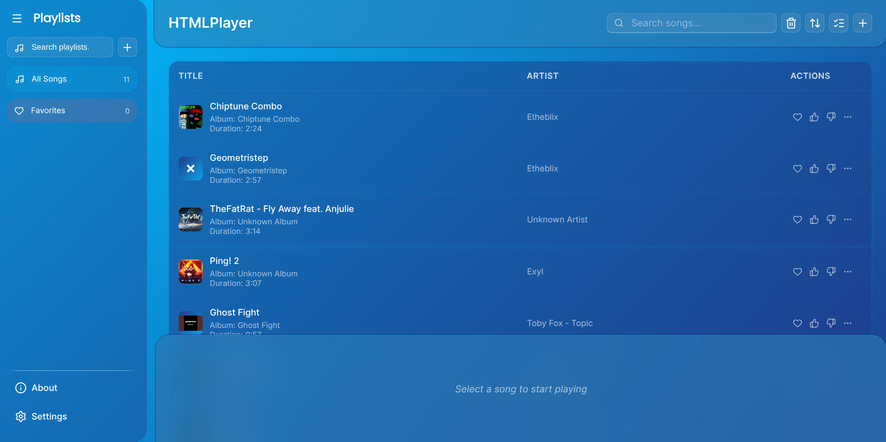
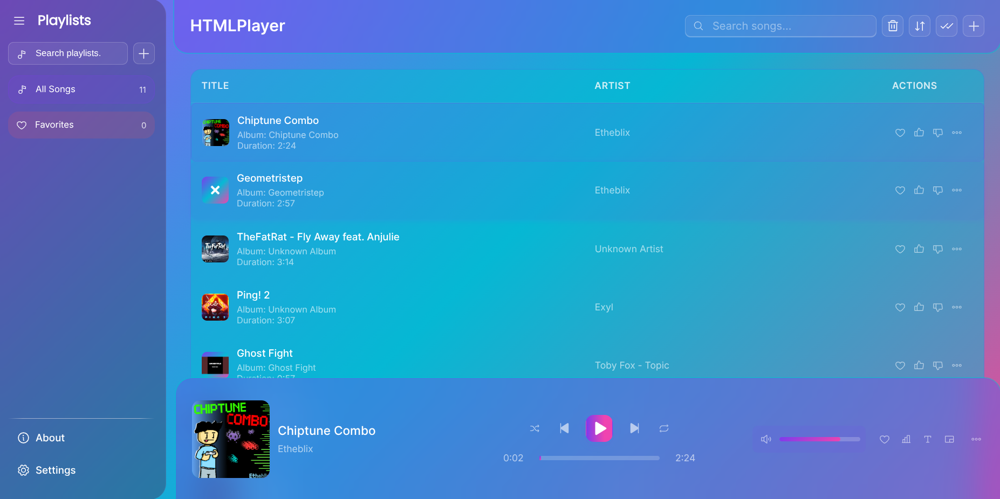
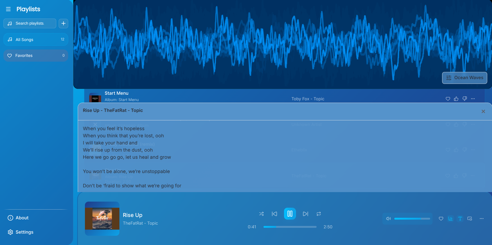
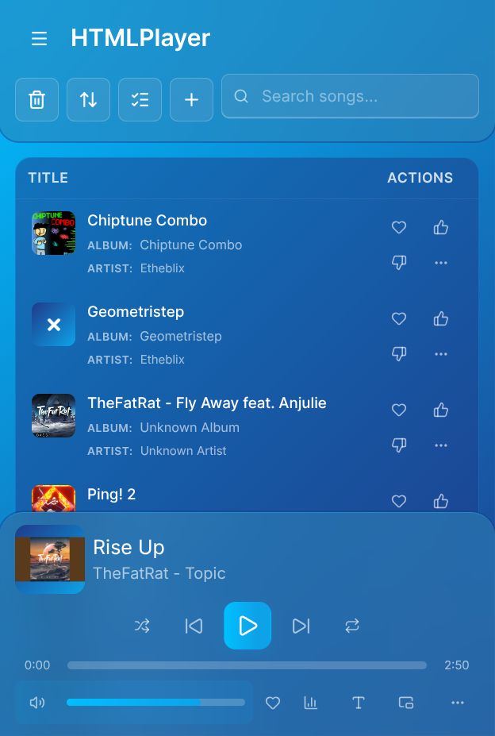
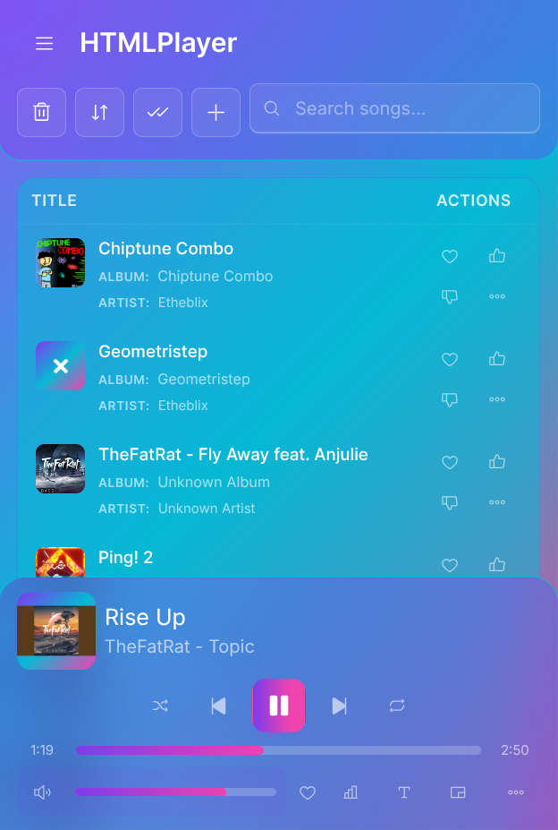
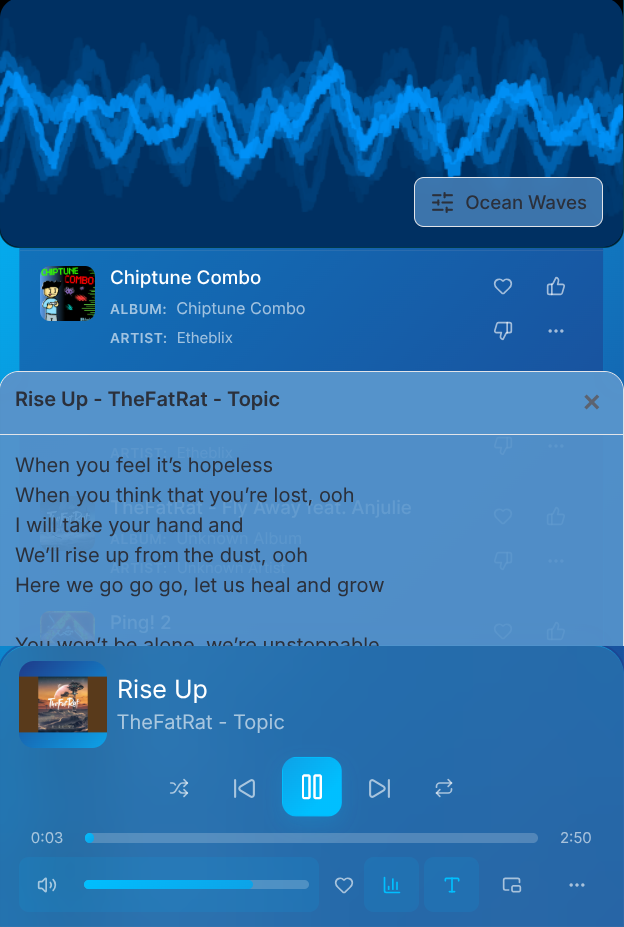

# HTMLPlayer

Modern local-first audio player for the browser and for desktop (via Tauri) with a full playlist workflow, rich metadata pipeline, and deep customization options.

[](#contributors)


<!-- markdownlint-disable MD033 -->
<a href="https://htmltoolkit.github.io/HTMLPlayer">
  <picture>
    <source srcset="https://chromeos.dev/badges/en/dark.svg" media="(prefers-color-scheme: dark)">
    
  </picture>
</a>

---

## Contents

* [Why v2.0](#why-v20)
* [Feature Overview](#feature-overview)
* [Architecture at a Glance](#architecture-at-a-glance)
* [Setup](#setup)
* [Tooling and Scripts](#tooling-and-scripts)
* [Usage Highlights](#usage-highlights)
* [Personalization and Settings](#personalization-and-settings)
* [Storage and Processing](#storage-and-processing)
* [Visualizers and Wallpapers](#visualizers-and-wallpapers)
* [Accessibility, Internationalization, and Guidance](#accessibility-internationalization-and-guidance)
* [Optional Discord Presence](#optional-discord-presence)
* [Troubleshooting](#troubleshooting)
* [Gallery](#gallery)
* [Contributing](#contributing)
* [Contributors](#contributors)
* [License](#license)

## Why v2.0

HTMLPlayer started as a single HTML file in v1.0. Version 2.0 is a ground-up rewrite using React, TypeScript, Vite, Zustand, and a modular helper layer under `Build/src`. The new stack unlocks desktop builds through Tauri, dramatically improves metadata handling, adds a smart shuffle and caching engine, and exposes personalization controls (themes, wallpapers, icon packs, keyboard shortcuts, languages). Everything still runs locally: no cloud backend is required, and your library is persisted in IndexedDB.

## Feature Overview

### Library ingestion and metadata

* Drag-and-drop or multi-select file picker powered by `Uppy` inside `helpers/filePickerHelper.tsx`, with directory support, launch queue handling, and Web Share Target ingestion on ChromeOS and Android.
* Tauri builds use native dialogs (`helpers/platform.ts`) so the same import flow works on Windows, macOS, and Linux.
* Imports stream through `workers/metadataWorker.ts` to extract ID3 tags, embedded lyrics (synced or unsynced), codec data, bitrate, and Apple gapless hints, while compressing cover art to keep IndexedDB light.
* `helpers/audioProcessor.ts` and `helpers/musicIndexedDbHelper.ts` persist the cleaned metadata and audio blobs to dedicated stores so the UI never has to hold large file buffers.
* Batch progress toasts (`sonner`) keep long imports transparent, and an optional `Example Audio Files/` folder is included for quick smoke tests.

### Playback engine

* `hooks/musicPlayerHook.tsx` coordinates playback, caching, and persistence. It drives the main `audio` element, manages an `AudioContext`, and syncs state through a BroadcastChannel so the main window, Picture-in-Picture mini player, and any portal stay aligned.
* Gapless playback can be enabled from Settings; `helpers/gaplessHelper.ts` applies encoder delay and padding values parsed from metadata, and crossfade automatically disables itself when gapless is active.
* `helpers/crossfadeHelper.ts` and `helpers/crossfadeUtils.ts` handle dual-audio-element fades with equal-power curves, tempo and pitch corrections, and analyzer node output for the visualizer.
* Smart shuffle (`helpers/shuffleManager.ts`) considers play history to avoid repeats, while `helpers/cacheManager.ts` preloads previous and next songs plus a shuffled buffer.
* A Safari-specific audio bridge in `helpers/safariHelper.ts` keeps playback stable on iOS and macOS Safari where the Web Audio API is throttled.

### Interface and navigation

* The `pages/_index.tsx` layout combines a collapsible sidebar, `MainContent` list view, `Home` spotlight dashboard, and the bottom `Player` component.
* Playlist folders, drag-and-drop reordering, right-click menus, and bulk select are powered by `components/Draggable.tsx`, `Playlist.tsx`, and `SongActionsDropdown.tsx`.
* The `Home` experience surfaces favorites, statistics, recently added songs, and quick actions (smart start, browse library, favorites, upload).
* The lyrics drawer (`components/Lyrics.tsx`) shows embedded text first and falls back to `lyrics.ovh` with metadata sanitizers from `@web-scrobbler/metadata-filter`.
* A `Document Picture-in-Picture` mini player (`components/Miniplayer.tsx`) mirrors theming and listens to BroadcastChannel updates via `hooks/useAudioSync.ts`.
* Guided onboarding uses `components/HelpGuide.tsx`, which loads localized `public/locales/*/tour.json` files so the tooltip copy is translated right alongside the UI text.

### Personalization

* Dynamic themes live in `helpers/themeLoader.tsx` and automatically import CSS from `themes/`. You can switch theme mode (light, dark, auto), icon sets (`helpers/iconLoader.tsx`), wallpapers (`helpers/wallpaperLoader.tsx`), font sizing, and compact layout directly inside Settings.
* Keyboard shortcuts are editable through `components/ShortcutConfig.tsx` and saved to a dedicated IndexedDB database via `helpers/shortcutsIndexedDbHelper.ts`.
* Tempo, pitch, volume, crossfade, gapless playback, autoplay, session restore, and other playback defaults are all managed within `components/Settings.tsx`.

### Power tools and persistence

* IndexedDB keeps three stores (`LIBRARY`, `SETTINGS`, `AUDIO_DATA`) so metadata, preferences, and raw audio are isolated. Clearing or exporting one does not nuke the others.
* Dialog dismissal choices (delete confirmation, import warnings) are saved per key and can be reset in Settings.
* A beta panel enables Discord presence logging and an `Eruda` mobile console for debugging on-device.
* The optional backend (`Backend/`) exposes OAuth login and token storage when you want Discord Rich Presence to update your user status. Currently in progress and unused as Discord, especially for web apps like HTMLPlayer, needs to specially approve updating rich prescence.

#### Tiny note

> One way to speed this up would be to star the repository, as it would help let me show that HTMLPlayer has a lot of users!

### Platform reach

* Web: installable PWA with support for launch handlers, file handlers, and share targets where browsers allow them.
* Desktop: Tauri bundle (`src-tauri/`) has native FS, dialog, notification, and URL opener plugins, so selecting folders or saving playlists feels native.
* Backend: lightweight Express server that exchanges OAuth codes, caches tokens, and calls Discord APIs for custom statuses. (WIP, and NOT USED)

## Architecture at a Glance

| Path | Purpose |
| --- | --- |
| `Build/src/components/` | UI primitives like the player chrome, dialogs, visualizer, lyrics drawer, playlist tree, and the settings sheet. |
| `Build/src/helpers/` | All domain logic: metadata ingest, caching, crossfade, shortcuts, theming, wallpapers, Discord client, gapless helpers, and platform detection. |
| `Build/src/hooks/` | Hooks for playback (`useMusicPlayer`), keyboard shortcuts, dialog visibility, and window-to-window audio sync. |
| `Build/src/workers/` | `metadataWorker.ts` parses ID3 tags, lyrics, and cover art off the main thread. |
| `Build/src/visualizers/` | 60+ visualizer definitions that follow the `VisualizerType` contract. |
| `Build/public/locales/` | i18n payloads plus tour definitions (`tour.json`) for each supported language (English and French today). |
| `Build/src-tauri/` | Rust bootstrap with dialog, notification, FS, and opener plugins for the desktop build. |
| `Backend/` | Express server used for Discord OAuth and presence updates. |
| `Example Audio Files/` | Small sample tracks for manual or automated tests. |

## Setup

### Prerequisites

* Node.js 18 or newer (19 works, 20+ is recommended)
* npm 9+ (pnpm or yarn also work if you adjust the commands)
* Rust stable toolchain if you plan to run the Tauri desktop build
* For Linux desktop builds: the standard Tauri dependencies (`build-essential`, `pkg-config`, GTK packages)

### Clone and install

```bash
git clone https://github.com/HTMLToolkit/HTMLPlayer.git
cd HTMLPlayer/Build
npm install
```

### Web development build

```bash
# Start Vite with full React HMR
npm run dev:web

# Production output (~/Build/dist)
npm run build:web

# Preview the production bundle
npm run preview
```

### Desktop (Tauri) build

```bash
# Launch the Tauri dev window
npm run dev:desktop

# Produce native binaries (macOS .app, Windows .exe/.msi, Linux AppImage/deb/rpm)
npm run build:desktop
```

`src-tauri/tauri.conf.json` defines the bundle metadata, icons, and build hooks. Tauri automatically reuses the Vite build output in `dist/`.

### Optional backend (Discord Rich Presence)

```bash
cd ../Backend
npm install
cp .env.example .env  # create this file if it is missing
```

`.env` expects:

```ini
DISCORD_CLIENT_ID=
DISCORD_CLIENT_SECRET=
DISCORD_REDIRECT_URI=https://your-domain.com/oauth/callback
PORT=3001
```

Run `npm start` to boot the Express server locally. The front-end will log requests if the backend is unreachable, so you can opt out safely.

## Tooling and Scripts

* `npm run lint` - ESLint against `src/**/*.ts?(x)` using the config in `Build/eslint.config.cjs`.
* `npm run test` - placeholder React Testing Library runner (wire up suites under `src/` as needed).
* `npm run make-pretty` - Prettier across TS/JS/CSS/MD/HTML.
* `npm run count-lines` - `cloc` excluding `node_modules`, `build`, `dist`, and lock files.
* `npm run i18n-check` - verifies every translation key referenced in code exists in the locale files.
* `npm run tauri` - direct passthrough to the Tauri CLI.

## Usage Highlights

1. **Import music** with the Upload button, drag-and-drop, a shared file, or the OS share sheet. Use the `Example Audio Files/` directory for quick smoke tests.
2. **Organize** songs into playlists and folders. Drag tracks or folders around, or drop a song on a playlist to copy it there.
3. **Multi-select** with the checkbox column to delete, move, or bulk-add songs to playlists.
4. **Inspect metadata** through the “More” menu. The info dialog surfaces codec, bitrate, sample rate, channel layout, bit depth, container, profile, and any gapless offsets detected.
5. **Toggle lyrics** and **visualizer** overlays from the player toolbar. Lyrics follow the current playback time when synced data is available.
6. **Open the mini player** if Document Picture-in-Picture is supported. Controls stay in sync with the main window thanks to `useAudioSync` plus `contexts/audioStore.ts`.
7. **Share or import on mobile** using the Web Share Target API (Chrome) or the file handler (ChromeOS). Shared text becomes a search query if text, and imported if a file, so you can jump directly to the referenced artist or track.
8. **Bookmark as a PWA** through the browser install prompt. Offline playback works because all audio blobs are cached locally in IndexedDB.

## Personalization and Settings

`components/Settings.tsx` exposes everything in one sheet:

* **Audio Controls**: master volume, tempo, pitch in semitones, crossfade length, gapless toggle, and Safari-specific notifications.
* **Playback Defaults**: shuffle on start, smart shuffle, repeat mode, autoplay, and session restore.
* **Interface**: color themes, icon sets, wallpapers (or no wallpaper), theme mode (light, dark, auto), compact layout, album art visibility, lyrics default, UI language, cache clearing, and dialog reset.
* **Shortcuts**: configure every keyboard shortcut (play/pause, prev/next, volume, mute, shuffle, repeat, lyrics, visualizer, global search, open settings). Values are validated to avoid collisions and saved in `HTMLPlayerShortcuts`.
* **Experimental**: enable Discord presence logging, paste a manual user ID if you bypass OAuth, and toggle the Eruda debug console when testing on phones.

All switches immediately persist through `helpers/musicIndexedDbHelper.ts`, so refreshing the tab or relaunching the desktop build keeps your preferences.

## Storage and Processing

* **Library**: `helpers/musicIndexedDbHelper.ts` stores songs, playlists, favorites, and play history. Binary audio data and cover art thumbnails are written to the `AUDIO_DATA` store separate from metadata to keep reads fast.
* **Audio caching**: `helpers/cacheManager.ts` builds a rolling cache of blob URLs (from remote files or IndexedDB) and purges old entries, while also writing long-term copies of imported songs.
* **Metadata worker**: `workers/metadataWorker.ts` sanitizes tag values, pulls multiple lyric formats (LRC, ID3, Vorbis), parses Apple `ITUNSMPB` tags, and compresses images before they hit the UI.
* **Processing pipeline**: `helpers/importAudioFiles.tsx` throttles metadata extraction in batches of 10 to avoid memory spikes. `helpers/audioProcessor.ts` then persists each blob, flipping a `hasStoredAudio` flag on the song to prevent redundant downloads.
* **Reset levers**: Settings exposes buttons to clear the audio cache, reset dialog preferences, or disable wallpapers/themes if you want to revert to a lightweight UI.

## Visualizers and Wallpapers

* Visualizers live in `Build/src/visualizers/` and load lazily via `helpers/visualizerLoader.ts`. Each entry exports a friendly name, data type (time or frequency), and optional settings (range sliders, numeric inputs, selects). Users can pick from ocean waves, galaxy spirals, architectural blueprints, particle fields, oscilloscope rings, and dozens more.
* Wallpaper definitions live under `themes/Wallpapers/` as React components with metadata described in the sibling `theme.json`. The renderer in `components/Wallpaper.tsx` keeps them isolated from the application layer and remounts when the selection changes to avoid animation leaks.

## Accessibility, Internationalization, and Guidance

* English (`en`) and French (`fr`) translations ship in `public/locales`. Add more locales by duplicating the folder, updating `supportedLanguages.ts`, and running `npm run i18n-check`.
* Keyboard navigation is available across menu buttons, select boxes, and dialogs via the Radix primitives used in `DropdownMenu`, `Select`, and `Dialog`.
* Toasts use `sonner` so screen readers announce them automatically.
* The guided tour (`components/HelpGuide.tsx`) reads from translated `tour.json` files and uses data attributes like `data-tour="player-controls"` to highlight UI landmarks.

## Optional Discord Presence

Discord integration is intentionally marked as beta. When enabled in Settings:

1. The front-end logs each track change through `helpers/discordService.ts`.
2. If the backend is running, the OAuth button opens Discord, exchanges the code inside `Backend/discord.js`, stores tokens in memory, and lets `setActivity` push a custom status (`details = song title`, `state = artist`).
3. Without the backend, the client no-ops but keeps a console log so you can verify payloads locally.

Because Discord’s RPC scope is gated, Rich Presence is not available inside the browser build. Desktop users can still show a custom status through the provided backend.

## Troubleshooting

* **Audio cached incorrectly**: use Settings → Interface → “Clear cached audio” to drop IndexedDB blob URLs, then re-import or play the track again to regenerate them.
* **Dialogs never show again**: click “Reset hidden dialogs” in Settings. This wipes only the `dialog-*` entries.
* **Safari behaves differently**: Safari intentionally disables Web Audio for background tabs, so we route playback through the native audio element and disable crossfade/gapless automatically. This is expected, yet SUPER annoying.
* **Document Picture-in-Picture is missing**: Safari and some Chromium/alternative browsers do not expose `documentPictureInPicture`, so the mini player button hides itself.
* **i18n keys missing**: run `npm run i18n-check` to list keys that exist in code but not in the locale JSON. Missing keys fall back to English at runtime.

## Gallery

| Desktop | Desktop (Custom Theme) | Desktop (Lyrics and Visualizer) | Desktop (Settings) |
| --- | --- | --- | --- |
|  |  |  |  |

| Mobile | Mobile (Custom Theme) | Mobile (Lyrics and Visualizer) | Mobile (Settings) |
| --- | --- | --- | --- |
|  |  |  |  |

## Contributing

1. Fork the repo and create a feature branch (`git checkout -b feature/my-update`).
2. Make your changes inside `Build/` or `Backend/` as needed.
3. Run `npm run lint` and, if applicable, `npm run i18n-check` and `npm run build:web`.
4. Include screenshots when touching UI-heavy components.
5. Open a pull request against `main` describing the change and how to reproduce it locally.

## Contributors

<!-- ALL-CONTRIBUTORS-LIST:START - Do not remove or modify this section -->
<!-- prettier-ignore-start -->
<!-- markdownlint-disable -->
<table>
  <tbody>
    <tr>
      <td align="center" valign="top" width="14.28%"><a href="https://github.com/TrickiyALT"><br /><sub><b>Trickiy</b></sub></a><br /><a href="#ideas-TrickiyALT" title="Ideas, Planning, & Feedback">🤔</a> <a href="#bug-TrickiyALT" title="Bug reports">🐛</a> <a href="#design-TrickiyALT" title="Design">🎨</a></td>
    </tr>
  </tbody>
</table>

<!-- markdownlint-restore -->
<!-- prettier-ignore-end -->

<!-- ALL-CONTRIBUTORS-LIST:END -->

## License

This project is licensed under the MIT License. See [LICENSE](LICENSE) for the full text.

Chromebook, ChromeOS, and the ChromeOS logo are trademarks of Google LLC.
